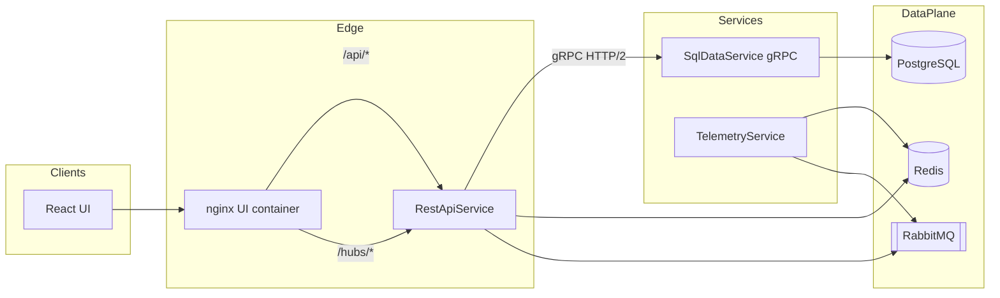

# Industrial Real-Time System

Sample **industrial telemetry** stack: twenty simulated sensors publish **latest values** to **Redis** and **change events** to **RabbitMQ**. **RestApi** merges **PostgreSQL** sensor metadata with **Redis** for HTTP clients, consumes RabbitMQ to **persist** readings and **push** live updates to browsers via **SignalR**. A **React** UI talks to the API and hub through **nginx** (same origin in Docker).

---

## Prerequisites

- **[.NET 8 SDK](https://dotnet.microsoft.com/download/dotnet/8.0)** — all backend projects target `net8.0`.
- **[Docker Desktop](https://www.docker.com/products/docker-desktop/)** (or Docker Engine + Compose) — for `docker compose` and integration tests (**Testcontainers**).
- **Node.js 20+** (the UI Docker image uses Node 22) — for local UI work: `npm ci` in `src/ui`.

Optional: `grpcurl` or any REST client for manual API checks.

---

## Repository layout

- **`src/SqlDataService`** — EF Core + PostgreSQL; **gRPC** service `SensorTelemetry` (sensors, save, history).
- **`src/RestApiService`** — **HTTP/JSON** + **SignalR**; gRPC client to SqlData; Redis reader; RabbitMQ consumer.
- **`src/TelemetryService`** — ~1 Hz simulator: writes **Redis** keys `sensor:{id}:latest`, then **RabbitMQ** `telemetry.updated`.
- **`src/Shared.Contracts`** — Protobuf under `Protos/`; generated C# (e.g. `Industrial.Sqldata.V1`).
- **`src/ui`** — Vite + React dashboard; SignalR client.
- **`contracts/`** — Human-oriented notes (e.g. `rabbitmq/message-schemas.md`).
- **`tests/*`** — Unit tests plus **Testcontainers** integration tests.
- **`docker-compose.yml`** — Full stack for local or demo runs.

---

## Local setup (without Docker for .NET services)

Use this when you run **Postgres, Redis, and RabbitMQ** yourself (or use Docker only for those three).

1. **Start infrastructure** (example: match `appsettings.json` defaults):

   - PostgreSQL: `localhost:5432`, database `industrial`, user/password `postgres` / `postgres`
   - Redis: `localhost:6379`
   - RabbitMQ: `localhost:5672`, user/password `guest` / `guest`

2. **Run SqlDataService** (applies migrations on startup for relational stores):

   ```bash
   cd src/SqlDataService
   dotnet run
   ```

   Default SQL connection is in `appsettings.json` (`ConnectionStrings:SqlData`). Kestrel uses **HTTP/2** for gRPC (see `Kestrel` section in appsettings).

3. **Run RestApiService** (point gRPC at SqlData, typically port **5108** locally):

   ```bash
   cd src/RestApiService
   dotnet run
   ```

   Configure `SqlDataGrpc:Address` (e.g. `http://localhost:5108`), `ConnectionStrings:Redis`, and `RabbitMQ` section as needed.

4. **Run TelemetryService**:

   ```bash
   cd src/TelemetryService
   dotnet run
   ```

   Set `ConnectionStrings:Redis` and `RabbitMQ:*` to match your brokers.

5. **Run the UI** (expects API at configurable base URL; for pure local dev you may point `VITE_API_BASE_URL` at `http://localhost:<rest-api-port>`):

   ```bash
   cd src/ui
   npm ci
   npm run dev
   ```

See **Docker Compose** below for the simplest “everything up” path.

---

## Docker Compose

From the repository root:

```bash
docker compose up --build
```

### Services and ports

Compose maps **host port → service**. Inside the stack, app containers listen on **8080** unless noted.

| Compose service | Host | Container |
|-----------------|------|-----------|
| `postgres` | 5432 | — |
| `redis` | 6379 | — |
| `rabbitmq` | 5672, 15672 | AMQP + management UI |
| `sql-data-service` | 5108 | 8080 (gRPC / HTTP2) |
| `telemetry-service` | 5109 | 8080 |
| `rest-api` | 5051 | 8080 |
| `ui` | 3000 | nginx **80** |

Details:

- **Postgres** — database `industrial`.
- **Redis** — latest values at `sensor:{id}:latest`.
- **RabbitMQ** — topic exchange and telemetry routing (see `contracts/`).
- **SqlData** — gRPC on host **5108**.
- **Telemetry** — simulator; Redis + Rabbit publish on **5109**.
- **Rest API** — REST, SignalR, Rabbit consumer on **5051**.
- **UI** — static app; nginx **proxies** `/api/` and `/hubs/` to `rest-api` (same origin). Dashboard: **http://localhost:3000**.

Healthchecks wait on Postgres, Redis, and RabbitMQ before dependents start.

### Useful commands

```bash
# Foreground with logs
docker compose up --build

# Detached
docker compose up -d --build

# Tear down (keep volume)
docker compose down

# Tear down and remove DB volume
docker compose down -v
```

---

## Tests

### CI (GitHub Actions)

On push or pull request to `main` / `master`, [`.github/workflows/ci.yml`](.github/workflows/ci.yml) runs **`dotnet restore`** and **`dotnet test Industrial.sln`** (including Testcontainers integration tests; the hosted runner provides Docker), then **`npm ci`** and **`npm run build`** in `src/ui`. You can also run the workflow manually from the **Actions** tab (`workflow_dispatch`).

### All tests (solution)

```bash
dotnet test Industrial.sln
```

### Unit tests only (exclude integration assembly)

```bash
dotnet test Industrial.sln --filter "FullyQualifiedName!~IntegrationTests"
```

### Integration tests only

Require **Docker** (Testcontainers pulls Postgres, Redis, RabbitMQ images):

```bash
dotnet test tests/IntegrationTests/IntegrationTests.csproj
```

### Projects

- **`tests/TelemetryService.Tests`** — twenty sensors per tick, Redis-before-Rabbit ordering, JSON shape.
- **`tests/SqlDataService.Tests`** — gRPC persistence and history (in-memory test DB).
- **`tests/RestApiService.Tests`** — SQL + Redis merge mapper; `WebApplicationFactory` smoke tests.
- **`tests/IntegrationTests`** — Docker-backed pipeline: Redis keys, SignalR `telemetryUpdated` for all sensors, REST merge, SQL via consumer.

---

## Architecture

High-level components and dependencies:



---

## Data flow (what talks to what)

### 1. SQL → API (and API → SQL)

- **Read path:** `RestApiService` calls **gRPC** `GetSensors`, `GetSensorById`, `GetTelemetryHistory` on **SqlDataService** for authoritative metadata and historical telemetry.
- **Write path:** `TelemetryUpdatedConsumer` in RestApi handles each RabbitMQ message: for each reading it calls **gRPC** `SaveTelemetry`, which inserts into PostgreSQL. The UI does not write SQL directly.

### 2. Redis → API → UI

- **Write path:** `TelemetryService` writes **latest** JSON per sensor to Redis keys `sensor:{id}:latest` **before** publishing to RabbitMQ (so “latest” is durable even if messaging hiccups).
- **Read path:** `GET /api/sensors` (and single-sensor GET) loads SQL metadata via gRPC, then **reads Redis** for each sensor and **merges** into the JSON response (`latestValue`, `latestCapturedAt`, etc.).
- **Live path:** After persisting, the consumer broadcasts the envelope on **SignalR** (`telemetryUpdated`). The UI subscribes and updates the dashboard without polling every sensor.

Together: **SQL** is source of truth for **identity and history**; **Redis** is optimized for **current snapshot**; **SignalR** pushes **“something changed”** events.

---

## Why gRPC, RabbitMQ, and SignalR?

### gRPC (SqlData ↔ RestApi)

**Protobuf** in `Shared.Contracts` gives typed contracts and compact payloads. Good fit for **service-to-service** calls in the cluster instead of exposing SQL or ad-hoc REST from the data tier. Streaming is available if you extend the API later.

### RabbitMQ

**Buffers** bursts and **decouples** `TelemetryService` (publish) from `RestApi` (consume). A topic exchange and routing key allow **more consumers** or new routes later without changing the publisher.

### SignalR

**Server push** (WebSockets with fallbacks) for many browsers; first-class in ASP.NET Core. Avoids the UI **polling** every sensor on an interval.

---

## Failure scenarios (as implemented)

- **Redis write fails (one sensor)** — Rabbit publish for that sensor is **skipped** for the tick (`TelemetryCycleExecutor`); other sensors continue.
- **Redis OK, Rabbit publish throws** — **Logged**; remaining sensors in the same tick still run.
- **Consumer receives invalid JSON** — Message **acked** (not requeued) to avoid poison loops.
- **SaveTelemetry returns NotFound** (unknown sensor) — **Ack**; warning in logs.
- **SaveTelemetry other gRPC errors** — **Nack** and **requeue** for retry.
- **Rabbit connection lost** — Consumer **reconnects** with backoff (`TelemetryUpdatedConsumer`).
- **RestApi cannot reach Redis or SqlData** — `GET /api/system/status` shows degraded state; responses may omit `latest*` fields if Redis is unavailable.

Ideas for production hardening: Redis TTL or versioning, idempotent ingest keys, dead-letter queues, gRPC circuit breakers.

---

## Scaling strategy

- **RestApi** — Scale HTTP behind a load balancer. **SignalR** needs **sticky sessions** or a **backplane** (e.g. Redis or Azure SignalR; not included here). Several instances **competing** on one Rabbit queue each get some messages: design for **at-most-once** or **idempotent** `SaveTelemetry`, or **one writer** / **partitioned queues**.
- **SqlDataService** — Read scaling via replicas later; writes limited by DB throughput. Pool connections; consider **batching** `SaveTelemetry` if volume grows.
- **TelemetryService** — Mostly CPU plus Redis and Rabbit I/O. To scale **out**, **shard** sensors so two instances do not write the same Redis keys.
- **Redis, RabbitMQ, Postgres** — Prefer managed HA in production; tune memory, persistence, and Rabbit **prefetch** under load.

---

## Logs and metrics

- **Today:** standard **Microsoft.Extensions.Logging** (`ILogger<T>`), levels controlled via `appsettings*.json` per service. Docker: `docker compose logs -f <service>`.
- **Metrics / tracing (not wired in this sample):** typical next steps are **OpenTelemetry** (traces + Prometheus metrics), structured JSON logs to **Loki** or your cloud log sink, and dashboards on **Redis/Rabbit/Postgres** exporter metrics.

---

## Stable vs likely-to-change

**Relatively stable**

- Protobuf names and RPCs under `Shared.Contracts/Protos`.
- Redis key pattern `sensor:{id}:latest` and fields the Rest API reads for merge.
- Rabbit exchange and routing conventions (documented under `contracts/`).
- The “twenty sensors” assumption in the simulator and seed data.

**Likely to change**

- UI layout, charts, and copy.
- Simulator math (`SinusoidalSensorValueGenerator`) and tick cadence.
- Published Docker **host** ports when they clash on a machine.
- History retention, pagination defaults, authentication.

When you change contracts or Redis payloads, update **RestApi** merge code and **`contracts/`** docs together.

---

## Possible alternative designs

1. **Monolith:** Single ASP.NET app with EF + Redis + Rabbit in one process—simpler ops, fewer network hops; worse isolation for teams or independent scaling.
2. **Kafka instead of RabbitMQ:** Higher throughput log-oriented ingest; heavier ops for small demos.
3. **REST instead of gRPC for SqlData:** Easier browser debugging; weaker typing and more serialization overhead service-to-service.
4. **Redis Pub/Sub or SSE instead of SignalR:** Lighter if you only broadcast fire-and-forget; you lose built-in connection management and fallback transports.
5. **UI reads Redis directly:** Removes merge from API but **duplicates** auth, schema, and CORS policy in the browser; usually worse for enterprise boundaries.
6. **Postgres `LISTEN/NOTIFY` or logical replication** instead of Rabbit for change feed—possible, but weaker cross-service buffering and routing than a broker.

---

## License / status

Educational / demonstration codebase. Adjust credentials, TLS, and authentication before any production deployment.
