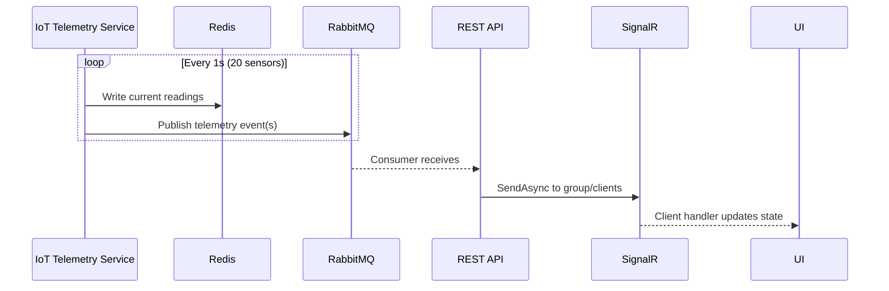
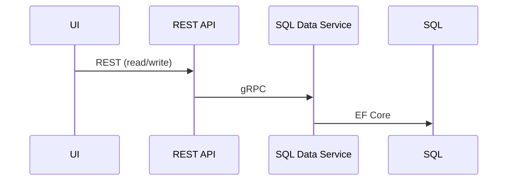

# Industrial Real-Time System — Architecture

This document describes the high-level architecture, service boundaries, communication patterns, shared contracts, and operational considerations for the technical home assignment. Implementation details live in service repositories under `src/services/` when those projects are added.

## 1. Goals and mandatory constraints

The system simulates **20 sensors**, each producing telemetry **once per second**. Telemetry **must originate in Redis** (the simulator writes current readings to Redis before they are considered authoritative). The UI must receive **real-time** updates **without polling** (no repeated HTTP for live telemetry).

### Communication rules (strict)

| Channel | Allowed between |
|--------|-------------------|
| **REST** | UI ↔ REST API only |
| **SignalR** | REST API ↔ UI only |
| **gRPC** | Backend services ↔ backend services |
| **RabbitMQ (AMQP)** | Backend services ↔ backend services |

Backend services **must not** use REST or SignalR to talk to each other. The UI **must not** use gRPC, RabbitMQ, Redis, or SQL directly.

### Stack (as chosen for this repo)

- **UI:** React + TypeScript, **exactly three** pages/routes.
- **REST API:** C# (ASP.NET Core), hosts REST + SignalR.
- **SQL Data Service:** C# + EF Core + SQL database, exposes **gRPC** only to other backends.
- **IoT Telemetry Service:** C#; owns Redis writes and sensor simulation; exposes **gRPC** and/or **RabbitMQ** to other backends only.
- **Infrastructure:** Redis, RabbitMQ, SQL database, `docker-compose` (added in a later step), CI in GitHub Actions (added in a later step).

## 2. High-level architecture

```text
┌─────────────┐   REST    ┌──────────────────────┐   gRPC / AMQP   ┌────────────────────┐
│  React UI   │◄────────►│  REST API (+SignalR) │◄───────────────►│  SQL Data Service   │
│  (3 pages)  │  SignalR │       (C#)           │                 │  (C# + EF Core)     │
└─────────────┘  (push)  └──────────┬───────────┘                 └──────────┬─────────┘
                                    │                                        │
                                    │ gRPC / AMQP                            │ SQL
                                    ▼                                        ▼
                         ┌──────────────────────┐                 ┌───────────────┐
                         │ IoT Telemetry Service │                 │   Database    │
                         │        (C#)           │                 └───────────────┘
                         └──────────┬───────────┘
                                    │
                           Redis ◄──┘ (writes first)
                                    │
                           RabbitMQ─┘ (events after Redis)
```


**Telemetry path (conceptual):** IoT Telemetry Service updates **Redis** every tick, then publishes **telemetry events** to **RabbitMQ** (and/or exposes **gRPC server-streaming** sourced from the same in-process pipeline). The REST API consumes those backend channels and **pushes** to the UI via **SignalR**. No HTTP polling on the UI for live values.

**Configuration / durable data:** The UI calls **REST**; the REST API calls the **SQL Data Service** via **gRPC**. Optional **RabbitMQ** events (e.g. configuration changed) allow the Telemetry service to adjust behavior without REST between backends.

## 3. Service responsibilities and boundaries

### REST API (C#)

- **Owns:** HTTP REST resources, SignalR hub(s), correlation of user-facing operations.
- **Delegates:** Persistence and domain rules to SQL Data Service via **gRPC**; live sensor pipeline to Telemetry contract via **gRPC** and/or **RabbitMQ** consumers.
- **Does not own:** Direct Redis or SQL access if boundaries are kept strict (telemetry and data each own their stores); avoids duplicating domain logic owned by other services.

### SQL Data Service (C# + EF Core + gRPC)

- **Owns:** SQL schema, migrations, transactional consistency, queries for configuration and reference data.
- **Exposes:** gRPC services for machines/sensors/configuration (see `src/Shared.Contracts/Protos`).
- **May publish:** Integration events to RabbitMQ after successful commits (optional; useful for cross-service reactions without polling).

### IoT Telemetry Service (C#)

- **Owns:** The 20×1 Hz simulation loop, Redis key layout for current readings, and any aggregation rules for emitted batches.
- **Writes Redis first** for each logical update so “telemetry originates in Redis.”
- **Propagates:** Same readings outward via RabbitMQ messages and/or gRPC streaming definitions in `src/Shared.Contracts/Protos` (single source of truth in code when implemented).
- **Does not own:** SignalR or REST.

### React UI

- **Exactly three pages** (suggested split): live dashboard (SignalR), configuration/administration (REST), system/operations status (REST for static metadata + connection state updated via SignalR events).
- **SignalR client** for all live telemetry; **no `setInterval` REST** for sensor streams.

## 4. Communication flows

### 4.1 Live telemetry (no UI polling)



Optional **gRPC stream** path (alternative or complement): `T --StreamTelemetry--> A --> H --> U`, fed from the same post-Redis pipeline inside Telemetry.

### 4.2 Configuration



### 4.3 Allowed backend mesh (reference)

Backends may call each other **only** via **gRPC** and **RabbitMQ** (e.g. Telemetry consuming `config.changed` events). No REST/SignalR on those edges.

## 5. Shared contracts

- **Protobuf:** `src/Shared.Contracts/Protos/` — packages under `industrial.*`; see files for message and RPC **skeletons** (generated C# is produced at build time into `obj/`).
- **RabbitMQ:** `contracts/rabbitmq/message-schemas.md` — exchange names, routing keys, and JSON envelope conventions.

SignalR method names and REST JSON shapes should stay aligned with the protobuf and AMQP schemas to reduce drift.

## 6. Technology choices (why)

| Technology | Rationale |
|------------|-----------|
| **gRPC** | Strongly typed contracts, efficient unary and streaming for service-to-service calls; fits SQL and Telemetry boundaries. |
| **RabbitMQ** | Decouples producers and consumers, buffers bursts, supports multiple subscribers (REST today, analytics tomorrow) without changing Redis writers. |
| **SignalR** | First-class push from ASP.NET Core to browsers; satisfies “no polling” for the UI while keeping UI ↔ server communication limited to REST + SignalR. |
| **Redis** | Low-latency store for **current** sensor values; assignment requires telemetry to **originate** there. |
| **SQL + EF Core** | Durable configuration and audit-friendly relational data separate from hot telemetry. |

## 7. Trade-offs and constraints

- **Duplication risk:** If both RabbitMQ and gRPC stream carry the same telemetry, operators must define a single **primary** path for REST→SignalR to avoid double delivery unless deduplicated (e.g. by `correlation_id` + sequence).
- **Backpressure:** RabbitMQ protects REST from Redis/tick bursts; gRPC streaming requires flow-control design in the Telemetry service.
- **Cold start / gap on connect:** UI may do **one** REST snapshot on load (not polling) or receive a **burst** first message on SignalR subscription; contract supports `GetSnapshot`-style RPC on Telemetry for tests and initial hydration.

## 8. Scaling and evolution

- **More sensors:** Partition Redis keys; shard or fan-out RabbitMQ exchanges; scale Telemetry horizontally with partitioned sensor ownership (consistent hashing by `sensor_id`).
- **Higher rates:** Coalesce publishes (e.g. 10 Hz per sensor but 20 Hz aggregate batches), binary payloads, or move hot path to gRPC streaming only and use MQ for side channels.

## 9. Failure scenarios (expected behavior)

| Failure | Behavior |
|---------|----------|
| **Redis unavailable** | Telemetry service cannot fulfill “write-first” rule; should fail safe (nack/retry), stop publishing stale claims, and surface degraded health via REST/health endpoints once implemented. |
| **RabbitMQ delayed** | UI telemetry lags; messages buffer in broker; consumers catch up; SignalR reflects delayed but ordered batches if sequencing is added. |
| **Service restart** | Transient loss of live stream; clients reconnect SignalR; optional snapshot RPC fills gaps. |
| **SQL unavailable** | Configuration REST fails with clear errors; live path may continue if Telemetry does not depend on SQL for the tick loop. |

## 10. Observability (recommended when implemented)

- **Structured logs** with `correlation_id` across REST → gRPC → MQ.
- **Metrics:** tick duration, Redis write latency, MQ publish/consume lag, SignalR connected clients, per-sensor last emitted timestamp.
- **Traces:** OpenTelemetry spans from consumer through SignalR send.

## 11. Stable vs. volatile parts

- **Stable:** Communication rules, three-page constraint, Redis-first telemetry rule, contract locations under `contracts/`.
- **Likely to change:** Exact sensor fields, routing key taxonomy, DB schema details, choice of MQ vs gRPC as primary hot path.

## 12. Alternative designs (brief)

- **Redis Streams only** for REST consumption would imply a different access pattern; assignment still allows MQ/gRPC between backends, so keeping **Redis write + MQ/gRPC read** matches the rubric cleanly.
- **Single “BFF” process** hosting REST + consumers is acceptable if service boundaries remain separate deployables in compose.

## 13. Related paths in this repo

| Path | Purpose |
|------|---------|
| `src/Shared.Contracts/Protos/sqldata/v1/sqldata.proto` | SQL persistence gRPC (`SensorTelemetry`: GetSensors, GetSensorById, SaveTelemetry, GetTelemetryHistory). |
| `contracts/rabbitmq/` | AMQP routing and payload documentation. |
| `src/ui/` | Frontend (to be scaffolded). |
| `src/RestApiService/`, `src/SqlDataService/`, `src/TelemetryService/` | Backend hosts. |
| `tests/` | Integration tests (to be added). |
| `prompts/` | Mandatory AI prompt documentation. |

## 14. Implementation order (recommended)

1. Finalize and version `src/Shared.Contracts/Protos` and RabbitMQ documentation under `contracts/rabbitmq`.
2. Add `docker-compose` and Dockerfiles for dependencies and services.
3. Implement SQL Data Service (EF Core + gRPC) + unit tests.
4. Implement IoT Telemetry Service (Redis + tick + publish/stream) + unit tests.
5. Implement REST API (gRPC clients, MQ consumer, SignalR) + unit tests.
6. Implement UI (three pages, SignalR + REST) + minimal component tests as needed.
7. Integration tests (Testcontainers, assert all 20 sensors propagate in real time without HTTP polling).
8. GitHub Actions: restore, build, test, build images.

This document satisfies the README architecture section checklist from the assignment when summarized or linked from `README.md` in a later step.
